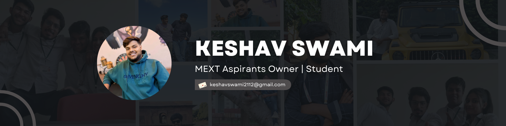

# 👋 Hello, I'm Keshav Swami

I’m a tech enthusiast and recent graduate in Artificial Intelligence and Data Science. I specialize in Python development, web technologies, and machine learning solutions. My passion lies in building practical, scalable tools that make technology more intuitive and accessible. 

  &emsp;
  

  

# 💻 Tech Stack:

 <!--  Python -->
 &emsp;
   <!-- Django -->
  &emsp;
 <!-- Linux -->
   &emsp;
 <!-- Jupyter -->
  &emsp;
  <!-- Next JS -->
  &emsp;
  <!-- React -->
  &emsp;
  <!-- MYSQL -->
  &emsp;
  <!-- Postresql -->
  &emsp;
  <!-- TensorFlow -->
  &emsp;
  <!-- Docker -->
  &emsp;
  <!-- C++ -->
   
  <!-- HTML5 -->
  &emsp;
  <!-- CSS -->
  &emsp;
  <!-- Java Script -->
  &emsp;
  <!-- JQuery -->
  &emsp;
  <!-- MarkDown -->
  &emsp;
  <!-- Git -->
  &emsp;
  <!-- Github -->
  &emsp;
  <!-- MaterialUI -->
  &emsp;
  <!-- Figma -->
  &emsp;
  <!-- Canva -->
  &emsp;

  

<picture>
  <source media="(prefers-color-scheme: dark)" srcset="https://raw.githubusercontent.com/KeshavSwami21/KeshavSwami21/output/github-snake-dark.svg" />
  <source media="(prefers-color-scheme: light)" srcset="https://raw.githubusercontent.com/KeshavSwami21/KeshavSwami21/output/github-snake.svg" />
  
</picture>
  

# 🏆 Trophies

  

  

  

# 🌐 Socials:

   

  
